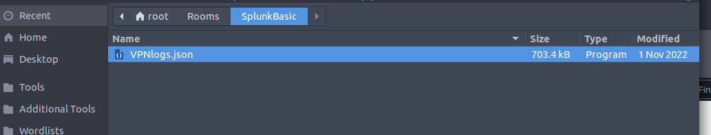
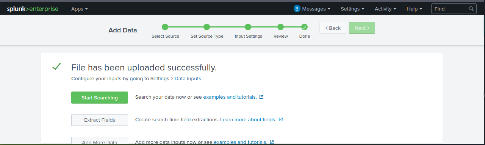
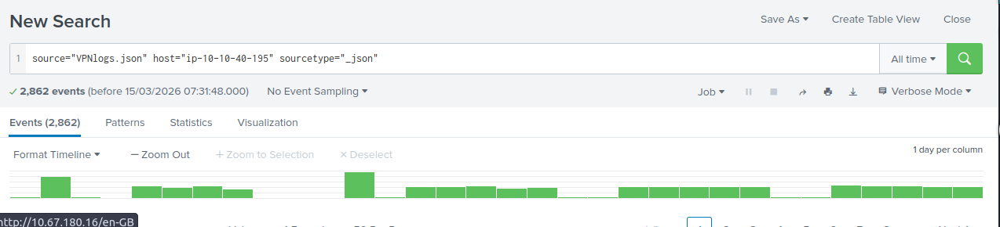

# 📌 Splunk SIEM Fundamentals – VPN Log Investigation & Event Correlation

---

## 1️⃣ Executive Summary

This lab focused on understanding how **Splunk Enterprise (SIEM)** ingests, parses, normalizes, and analyzes VPN log data. The objective was to explore Splunk’s core components and perform practical log investigations using real-world scenarios.

Using a JSON-based VPN log dataset containing **2,862 events**, multiple analytical tasks were completed including:

- Event volume analysis  
- User-based filtering  
- IP-to-username correlation  
- Geographic event exclusion queries  
- Targeted IP investigation  

This exercise simulates foundational **SOC analyst responsibilities** such as:

- Threat triage  
- User activity tracking  
- Anomaly investigation  

---

## 2️⃣ Lab Objectives (Aligned with TryHackMe Room)

- Understand Splunk architecture and data ingestion workflow  
- Explore Splunk search & reporting interface  
- Analyze structured log data  
- Perform targeted investigations using search queries  
- Correlate IP addresses with user accounts  
- Apply filtering logic using SPL  

---

## 3️⃣ Tools & Environment

| Tool | Purpose |
|------|----------|
| **Splunk Enterprise** | SIEM platform for log ingestion and analysis |
| **VPNLogs.json** | Structured VPN log dataset |
| **Browser-Based Splunk Interface** | Query execution & visualization |

---

## 4️⃣ Methodology

---

### 🔹 Step 1 – Log Ingestion

**Process:**
- Uploaded `VPNLogs.json` via *Add Data*
- Confirmed successful ingestion
- Data indexed and transformed into searchable events

**Parsed Fields:**
- `username`
- `source_ip`
- `source_country`
- `timestamp`
- `event_type`

### 📸 Evidence





---

### 🔹 Step 2 – Total Event Count

**Query Approach:**
Used default search view after ingestion.

📊 **Result:**  
**Total events in log file: 2,862**
### 📸 Evidence


✅ Confirms proper ingestion and indexing.

---

### 🔹 Step 3 – User Activity Analysis

**Objective:**  
Identify how many events were generated by user `Maleena`.

**Method:**
```spl
username="Maleena"
```

📊 **Result:**  
**60 events**

🔎 **SOC Insight:**  
User-based event analysis helps detect:
- Brute force attempts  
- Suspicious login patterns  
- Privilege misuse  

---

### 🔹 Step 4 – IP to Username Correlation

**Objective:**  
Identify username associated with IP `107.14.182.38`

**Method:**
```spl
source_ip="107.14.182.38"
```

📊 **Result:**  
**Associated username: Smith**

💡 Demonstrates IP-to-user attribution — critical in incident response.

---

### 🔹 Step 5 – Country-Based Event Filtering

**Objective:**  
Determine number of events from all countries excluding France.

**SPL Logic Used:**
```spl
NOT source_country="France"
```

📊 **Result:**  
**2,814 events**

🌍 **SOC Relevance:**
- Detect abnormal login regions  
- Identify impossible travel scenarios  
- Apply geo-blocking rules  

---

### 🔹 Step 6 – Targeted IP Investigation

**Objective:**  
How many events are linked to IP `107.3.206.58`?

**Method:**
```spl
source_ip="107.3.206.58"
```

📊 **Result:**  
**14 events**

✔ Confirmed by reviewing event list and validating IP consistency.

---

## 5️⃣ Key Findings Summary

| Investigation Task | Result |
|--------------------|--------|
| Total VPN Events | 2,862 |
| Events by Maleena | 60 |
| IP 107.14.182.38 User | Smith |
| Events Excluding France | 2,814 |
| Events for IP 107.3.206.58 | 14 |

---

## 6️⃣ Lessons Learned (SOC-Level Perspective)

✔ How Splunk transforms raw logs into structured events  
✔ Importance of clearing previous filters before new queries  
✔ Field-based filtering vs free-text searching  
✔ Verification via List View vs Table View  
✔ Log correlation techniques used in real SOC environments  

> 💡 **Key Takeaway:**  
> SIEM tools are only powerful when analysts understand how to ask the right investigative questions.

---

## 7️⃣ Skills Demonstrated

- SIEM Operation  
- Log Ingestion  
- SPL Querying  
- IP-to-User Correlation  
- Event Filtering  
- Geo-based Analysis  
- Incident Investigation Workflow  

---

### 🛡️ SOC Analyst Portfolio Project  
*Focused on Security Operations, Threat Detection & Incident Response*
